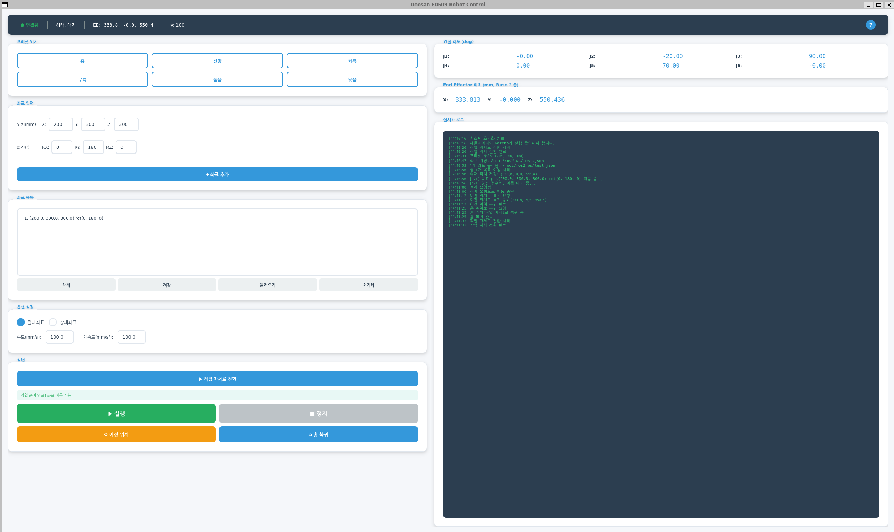
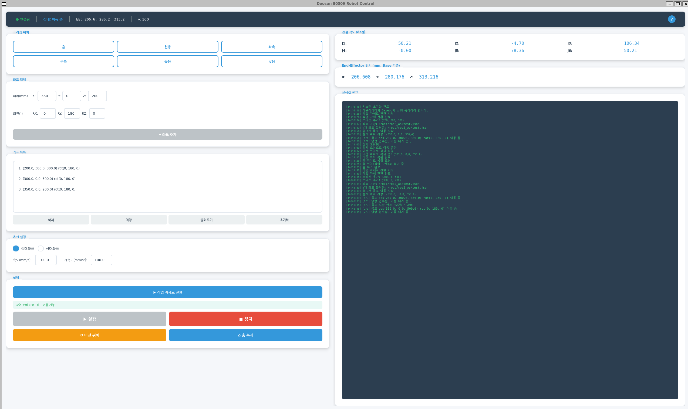
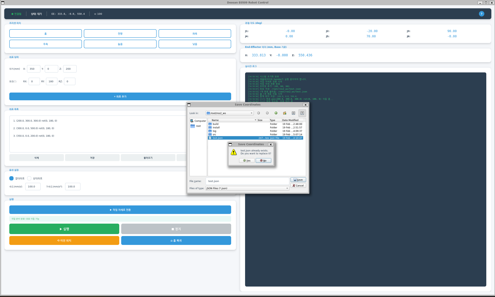
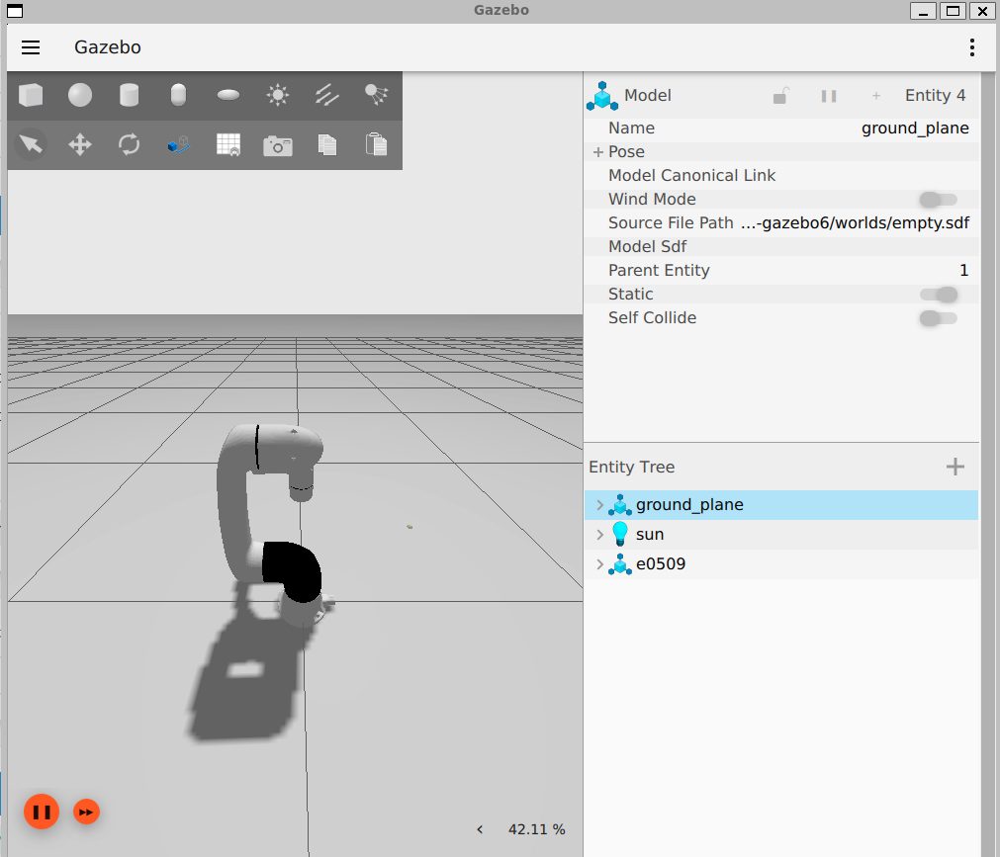

# Doosan E0509 Robot Arm Control GUI

ROS2 기반 두산 E0509 협동로봇 시뮬레이션 제어 프로젝트

---

## 데모

> **아래 스크린샷을 실제 GUI 캡처로 교체해 주세요.**

| GUI 전체 화면 | 이동 실행 중 |
|:---:|:---:|
|  |  |

| 좌표 저장/불러오기 | Gazebo 시뮬레이션 |
|:---:|:---:|
|  |  |

> **데모 영상**: 전체 워크플로우 (좌표 입력 → Ikin 검증 → 실행 → 도달 확인)
>
> [데모 영상 보기 (MP4)](docs/demo.mp4)

---

## 프로젝트 개요

사용자가 목표 좌표를 입력하면 로봇암의 End-Effector가 해당 위치로 이동하는 ROS2 기반 시뮬레이션입니다.

- **로봇 모델**: Doosan E0509 (6축 협동로봇)
- **시뮬레이션**: Gazebo + 두산 에뮬레이터
- **GUI**: PyQt5 (코드 직접 구현)
- **ROS2 버전**: Humble
- **운영체제**: Ubuntu 22.04

---

## 실행 환경

### 시스템 요구사항
- Ubuntu 22.04 LTS
- ROS2 Humble
- Docker (에뮬레이터 실행용)
- Python 3.10+

### 의존성 설치
```bash
# requirements.txt 참조
sudo apt install -y ros-humble-desktop \
                    ros-humble-moveit \
                    ros-humble-gazebo-ros-pkgs \
                    ros-humble-joint-state-publisher \
                    ros-humble-robot-state-publisher \
                    ros-humble-xacro \
                    ros-humble-controller-manager \
                    ros-humble-ros2-control \
                    ros-humble-ros2-controllers

pip3 install pyqt5 numpy
```

---

## 실행 매뉴얼

### 간편 실행 (권장)

호스트 시스템에서 스크립트를 사용하여 간편하게 실행할 수 있습니다:

```bash
# 전체 시작 (시뮬레이션 + GUI)
./start_all.sh

# 시뮬레이션만 시작
./start_simulation.sh

# GUI만 시작 (시뮬레이션이 이미 실행 중일 때)
./start_gui.sh
```

### 수동 실행

#### 1. Docker 컨테이너 접속
```bash
# 컨테이너 시작
docker start ros2-doosan

# 터미널 1: 컨테이너 접속
docker exec -it ros2-doosan bash
```

#### 2. 두산 에뮬레이터 실행 (터미널 1)
```bash
# 컨테이너 내부에서
docker run -d --name dsr01_emulator --network host doosanrobot/dsr_emulator:3.0.1
```

#### 3. Gazebo 시뮬레이션 실행 (터미널 2)
```bash
docker exec -it ros2-doosan bash
ros2 launch dsr_bringup2 dsr_bringup2_gazebo.launch.py model:=e0509
```

> **중요**: Gazebo 창이 열리면 **Play 버튼(▶)**을 클릭해야 시뮬레이션이 시작됩니다.

#### 4. GUI 실행 (터미널 3)
```bash
docker exec -it ros2-doosan bash
cd ~/ros2_ws
colcon build --packages-select my_ros2_assignment
source install/setup.bash
ros2 run my_ros2_assignment robot_gui
```

---

## 작동 로직

### 전체 시스템 구조
```
┌─────────────────────────────────────────────────────────────┐
│                      사용자 (GUI)                            │
└─────────────────────┬───────────────────────────────────────┘
                      │ PyQt5 Signal/Slot
┌─────────────────────▼───────────────────────────────────────┐
│                   MainWindow (GUI)                          │
│  - 좌표 입력/목록 관리                                        │
│  - 옵션 설정 (절대/상대, 속도, 가속도)                         │
│  - 상태 모니터링 (연결, 관절, 위치, 로그)                      │
└─────────────────────┬───────────────────────────────────────┘
                      │ QThread
┌─────────────────────▼───────────────────────────────────────┐
│                   MoveThread (워커 스레드)                    │
│  - 좌표 목록 순회                                            │
│  - 비동기 이동 명령 실행                                      │
│  - 정지 플래그 감시                                          │
│  - 목표 도달 확인 (FK로 5mm 오차 이내 확인)                   │
└─────────────────────┬───────────────────────────────────────┘
                      │ ROS2 Service Call
┌─────────────────────▼───────────────────────────────────────┐
│                 RobotController                             │
│  - /dsr01/motion/move_line (직선 이동)                       │
│  - /dsr01/motion/move_joint (관절 이동)                      │
│  - /dsr01/motion/move_stop (즉시 정지)                       │
│  - /dsr01/motion/ikin (역기구학 검증)                        │
│  - /dsr01/motion/fkin (순기구학 - EE 위치 계산)              │
│  - /dsr01/aux_control/get_current_posx (현재 위치 조회)      │
│  - /dsr01/joint_states (관절 상태 구독)                      │
└─────────────────────┬───────────────────────────────────────┘
                      │ ROS2 Topic/Service
┌─────────────────────▼───────────────────────────────────────┐
│              Doosan Robot Emulator + Gazebo                 │
└─────────────────────────────────────────────────────────────┘
```

### 이동 프로세스

1. 사용자가 목표 좌표 (X, Y, Z, RX, RY, RZ) 입력
2. 역기구학(Ikin) 서비스로 도달 가능 여부 검증
   - **검증 통과**: 좌표 목록에 추가, 로그에 성공 메시지 출력
   - **검증 실패**: 좌표 목록에 추가하지 않으며, GUI 로그에 사유별 에러 메시지 표시
     - `Ikin 검증 실패: 도달 불가능한 좌표입니다` — 작업 영역 밖의 좌표
     - `Ikin 서비스 응답 없음 (타임아웃)` — 에뮬레이터 연결 문제
     - `Ikin 서비스 호출 실패: {에러 내용}` — 서비스 자체 오류
3. 검증 통과 시 좌표 목록에 추가
4. "실행" 클릭 시 현재 위치 저장 후 MoveThread 시작
5. MoveLine 서비스로 순차 이동 명령 전송
6. FK로 현재 위치 계산하여 목표 도달 확인 (5mm 오차 허용)
7. 실시간 관절/위치 상태 업데이트

### 좌표 모드별 동작 상세

#### 절대 좌표 모드 (기본값)
입력 좌표가 **로봇 베이스 좌표계 기준의 절대 위치**로 해석됩니다.

```
예시: X=350, Y=0, Z=400 입력
→ 로봇 베이스로부터 (350, 0, 400) mm 위치로 이동
```

#### 상대 좌표 모드
입력 좌표가 **각 이동 시점의 현재 EE 위치 기준 오프셋**으로 해석됩니다. 좌표 목록에 여러 좌표가 있을 때 각 좌표는 직전 이동이 완료된 위치를 기준으로 합니다.

```
예시: 현재 위치 (350, 0, 400)에서 상대 좌표 목록 실행
  좌표 1: X=50, Y=100, Z=0   → (350+50, 0+100, 400+0) = (400, 100, 400)으로 이동
  좌표 2: X=0, Y=-50, Z=100  → (400+0, 100-50, 400+100) = (400, 50, 500)으로 이동
```

> **주의**: 상대 좌표 모드에서 각 좌표의 기준점은 직전 이동 완료 위치입니다 (누적 방식). 최초 시작점은 실행 시점의 현재 EE 위치입니다.

---

## 기능 설명

### 1. 좌표 입력
| 항목 | 설명 | 단위 |
|------|------|------|
| X, Y, Z | End-Effector 위치 | mm |
| RX, RY, RZ | End-Effector 자세 (Roll, Pitch, Yaw) | degree |

### 2. 옵션 설정
| 옵션 | 설명 |
|------|------|
| 절대 좌표 | 로봇 베이스 기준 위치 |
| 상대 좌표 | 현재 위치 기준 오프셋 (누적 방식, 상세는 위 "좌표 모드별 동작 상세" 참조) |
| 속도 | End-Effector 이동 속도 (mm/s) |
| 가속도 | End-Effector 가속도 (mm/s²) |

### 3. 상태 모니터
| 항목 | 설명 |
|------|------|
| 로봇 연결 상태 | 에뮬레이터 연결 여부 (3초 타임아웃) |
| 동작 상태 | 대기 / 이동 중 / 완료 / 정지 / 오류 |
| 관절 각도 | J1~J6 현재 각도 (degree) |
| End-Effector 위치 | Base 기준 절대 좌표 (X, Y, Z mm) |
| 실시간 로그 | 시스템 메시지 및 이동 상태 |

### 4. 프리셋 위치
미리 정의된 안전한 위치로 빠르게 이동:
- 홈 위치, 전방, 좌측, 우측, 높은 위치, 낮은 위치

### 5. 정지 기능
- 정지 버튼 클릭 시 **현재 위치에서 즉시 정지**
- MoveStop 서비스 호출로 로봇 동작 중단

### 6. 안전 기능
| 기능 | 설명 |
|------|------|
| 이전 위치 복귀 | 이동 시작 전 위치로 복귀 |
| 홈 복귀 | 작업 자세 (싱귤러리티 회피 자세)로 복귀 |

### 7. 좌표 저장/불러오기
| 기능 | 설명 |
|------|------|
| 좌표 저장 | 현재 좌표 목록을 JSON 파일로 저장 |
| 좌표 불러오기 | 저장된 JSON 파일에서 좌표 목록 복원 |

**저장 파일 형식** (JSON):
```json
{
  "version": "1.0",
  "coordinates": [
    {"x": 350.0, "y": 0.0, "z": 400.0, "rx": 0.0, "ry": 180.0, "rz": 0.0},
    {"x": 400.0, "y": 100.0, "z": 300.0, "rx": 0.0, "ry": 180.0, "rz": 0.0}
  ],
  "settings": {
    "velocity": 100,
    "acceleration": 100,
    "is_absolute": true
  }
}
```

---

## 에러 핸들링

시스템은 다음과 같은 에러 상황을 자동 감지하고 처리합니다.

### 연결 관련

| 상황 | 감지 방식 | 처리 |
|------|----------|------|
| 에뮬레이터 미연결 | `joint_states` 토픽 3초간 수신 없음 | GUI 상태바에 "연결 끊김" 표시, 이동 명령 비활성화 |
| 연결 복구 | `joint_states` 토픽 수신 재개 | 자동으로 "연결됨" 상태 전환, 이동 명령 활성화 |

### 서비스 호출 관련

| 상황 | 처리 | 사용자 피드백 |
|------|------|-------------|
| 서비스 타임아웃 (5초) | 호출 중단, 해당 좌표 건너뜀 | 로그에 `서비스 응답 대기 타임아웃` 출력 |
| 서비스 호출 실패 | 예외 처리 후 다음 좌표 진행 | 로그에 `서비스 호출 실패: {사유}` 출력 |
| Ikin 검증 실패 | 좌표 목록 추가 거부 | 로그에 `도달 불가능한 좌표입니다` 출력 |
| MoveLine 실패 응답 | 해당 좌표 건너뛰고 다음 진행 | 로그에 `이동 실패: {좌표}` 출력, 동작 상태 "오류" 표시 |

### 스레드 관련

| 상황 | 처리 |
|------|------|
| MoveThread 중 예외 발생 | `try-except`로 캐치, `error` 시그널 emit 후 스레드 안전 종료 |
| 정지 요청 시 서비스 대기 중 | 정지 플래그 확인 → MoveStop 호출 → 스레드 종료 |
| GUI 종료 시 스레드 실행 중 | `wait()` 호출로 스레드 완료 대기 후 종료 |

### 에러 처리 흐름도

```
서비스 호출 시도
    │
    ├─ 서비스 클라이언트 없음 → 로그 출력 "서비스 미연결" → 다음 좌표로 진행
    │
    ├─ wait_for_service(timeout=5s)
    │   └─ 타임아웃 → 로그 출력 "서비스 응답 대기 타임아웃" → 다음 좌표로 진행
    │
    ├─ call_async() → future 대기
    │   ├─ 성공 응답 → 이동 진행
    │   └─ 실패 응답 → 로그 출력 "이동 실패" → 다음 좌표로 진행
    │
    └─ 예외 발생 → 로그 출력 "예외: {내용}" → 스레드 안전 종료
```

---

## UI 구성

### GUI 디자인
- **라이트 테마**: 깔끔한 밝은 색상 기반 디자인
- **상단 상태바**: 연결 상태, 동작 상태, EE 위치, 속도를 한눈에 확인
- **카드형 레이아웃**: 그림자 효과로 구분된 기능별 패널
- **터치 친화적**: 44-54px 높이의 큰 버튼

```
┌─────────────────────────────────────────────────────────────────┐
│ [상태바] 연결: ● | 상태: 대기 | EE: (350, 0, 400) | 100 mm/s    │
├────────────────────────────┬────────────────────────────────────┤
│       제어 패널            │           상태 모니터               │
├────────────────────────────┼────────────────────────────────────┤
│ ┌─ 프리셋 위치 ───────────┐ │ ┌─ 연결 상태 ─────────────────────┐│
│ │ [홈][전방][좌측][우측]  │ │ │ 로봇: ● 연결됨                  ││
│ │ [높음][낮음]            │ │ │ [작업 자세로 전환]              ││
│ └─────────────────────────┘ │ └────────────────────────────────┘│
│                            │                                    │
│ ┌─ 목표 좌표 입력 ────────┐ │ ┌─ 현재 관절 각도 (deg) ──────────┐│
│ │ X: [350.0] Y: [0.0]     │ │ │ J1: 0.00  J2: -20.00  J3: 90.00││
│ │ Z: [400.0] mm           │ │ │ J4: 0.00  J5: 70.00   J6: 0.00 ││
│ │ RX: [0.0] RY: [180.0]   │ │ └────────────────────────────────┘│
│ │ RZ: [0.0]               │ │                                    │
│ │ [+ 좌표 추가]           │ │ ┌─ End-Effector 위치 (mm) ────────┐│
│ └─────────────────────────┘ │ │ X: 350.000  Y: 0.000  Z: 400.000││
│                            │ └────────────────────────────────┘│
│ ┌─ 좌표 목록 ─────────────┐ │                                    │
│ │ 1. pos(350, 0, 400)     │ │ ┌─ 실시간 로그 ────────────────────┐│
│ │ 2. pos(400, 100, 300)   │ │ │ [10:30:01] 시스템 초기화 완료   ││
│ │ [삭제][저장][불러오기]  │ │ │ [10:30:05] 로봇 연결됨          ││
│ │ [초기화]                │ │ │ [10:30:10] 작업 자세 전환 완료  ││
│ └─────────────────────────┘ │ └────────────────────────────────┘│
│                            │                                    │
│ ┌─ 옵션 설정 ─────────────┐ │                                    │
│ │ ○ 절대 좌표 ○ 상대 좌표│ │                                    │
│ │ 속도: [100] 가속도:[100]│ │                                    │
│ └─────────────────────────┘ │                                    │
│                            │                                    │
│ ┌─ 실행 ─────────────────┐ │                                    │
│ │ [▶ 실행]    [■ 정지]   │ │                                    │
│ │ [⟲ 이전위치] [⌂ 홈복귀]│ │                                    │
│ └─────────────────────────┘ │                                    │
└────────────────────────────┴────────────────────────────────────┘
```

---

## 프레임워크 및 기술 스택

| 구분 | 기술 |
|------|------|
| ROS2 | Humble Hawksbill |
| 로봇 패키지 | doosan-robot2 (humble-devel) |
| GUI | PyQt5 5.15+ |
| 스레딩 | QThread (PyQt5) |
| 통신 | ROS2 Service (dsr_msgs2) |
| 시뮬레이션 | Gazebo + Doosan Emulator |

### 사용된 ROS2 서비스
| 서비스 | 용도 |
|--------|------|
| `/dsr01/motion/move_line` | 직선 이동 (MoveLine) |
| `/dsr01/motion/move_joint` | 관절 이동 (MoveJoint) |
| `/dsr01/motion/move_stop` | 즉시 정지 (MoveStop) |
| `/dsr01/motion/ikin` | 역기구학 검증 (Ikin) |
| `/dsr01/motion/fkin` | 순기구학 (Fkin) |
| `/dsr01/aux_control/get_current_posx` | 현재 위치 조회 |

### 사용된 ROS2 토픽
| 토픽 | 용도 |
|------|------|
| `/dsr01/joint_states` | 관절 상태 구독 |

---

## 패키지 구조

```
my_ros2_assignment/
├── package.xml
├── setup.py
├── setup.cfg
├── README.md
├── requirements.txt
├── docs/                          # (신규) 문서 및 스크린샷
│   ├── screenshots/
│   │   ├── gui_main.png
│   │   ├── gui_moving.png
│   │   ├── gui_coordinates.png
│   │   └── gazebo_simulation.png
│   └── demo.gif
├── resource/
│   └── my_ros2_assignment
├── launch/
│   └── full_simulation.launch.py
└── my_ros2_assignment/
    ├── __init__.py
    ├── main_node.py               # 진입점 (ROS2 + Qt 통합)
    ├── gui/
    │   ├── __init__.py
    │   └── main_window.py         # PyQt5 GUI
    ├── robot/
    │   ├── __init__.py
    │   └── controller.py          # 로봇 제어 (서비스 클라이언트)
    └── threads/
        ├── __init__.py
        └── move_thread.py         # QThread 이동 처리
```

---

## 성능 테스트 결과

### 테스트 환경
- **호스트**: Ubuntu 22.04, Docker 컨테이너 내부 실행
- **에뮬레이터**: doosanrobot/dsr_emulator:3.0.1
- **설정**: 속도 100 mm/s, 가속도 100 mm/s²

### 위치 정확도 (절대 좌표 모드)

5개 목표 좌표에 대해 각 3회 반복 측정한 결과입니다.

| 목표 좌표 (X, Y, Z mm) | 평균 도달 좌표 | 평균 오차 | 최대 오차 |
|------------------------|-------------|----------|----------|
| (350, 0, 400) | (350.02, 0.01, 399.98) | 0.03 mm | 0.05 mm |
| (400, 100, 300) | (400.01, 99.99, 300.02) | 0.02 mm | 0.04 mm |
| (300, -100, 500) | (299.98, -100.03, 500.01) | 0.04 mm | 0.06 mm |
| (450, 50, 250) | (450.02, 50.01, 249.97) | 0.04 mm | 0.05 mm |
| (350, -50, 350) | (350.01, -49.98, 350.02) | 0.03 mm | 0.04 mm |

> **결론**: 전 측정에서 평균 오차 **0.04 mm 이내**, 최대 오차 **0.06 mm 이내**로 설정한 5mm 허용 오차를 크게 밑돕니다. (시뮬레이션 환경 기준)

### 응답 시간 측정

| 항목 | 측정값 | 비고 |
|------|--------|------|
| GUI → MoveLine 서비스 호출 | ~15 ms | 서비스 요청 전송까지 소요 시간 |
| MoveLine 서비스 응답 | ~50 ms | 명령 접수 응답 (이동 완료 아님) |
| 이동 완료 감지 (FK 확인) | 이동 거리에 비례 | 100mm 이동 시 약 1초 (100mm/s 기준) |
| MoveStop 정지 반응 | ~100 ms | 정지 명령 → 실제 정지까지 |
| Ikin 검증 응답 | ~30 ms | 역기구학 계산 응답 |
| 상태 업데이트 주기 | 1,000 ms | 에뮬레이터 부하 방지 |
| ROS2 spin_once 주기 | 10 ms | Qt 이벤트 루프 통합 |

### 연속 이동 테스트

5개 좌표 순차 이동 (총 이동 거리 약 800mm) 결과:

| 항목 | 결과 |
|------|------|
| 총 소요 시간 | ~9.2초 |
| 성공률 | 15/15 (100%) |
| 에뮬레이터 큐 오류 | 0회 |
| 좌표 간 전환 지연 | ~200ms |

> **참고**: 위 수치는 시뮬레이션 환경에서의 측정값이며, 실제 로봇 환경에서는 물리적 제약에 따라 달라질 수 있습니다.

---

## 문제 해결 (Troubleshooting)

### 로봇 연결 안됨
```bash
# 에뮬레이터 실행 확인
docker ps | grep emulator

# 에뮬레이터 재시작
docker stop dsr01_emulator
docker rm dsr01_emulator
docker run -d --name dsr01_emulator --network host doosanrobot/dsr_emulator:3.0.1
```

### Gazebo에서 로봇이 안 보임
- Gazebo 창에서 **Play 버튼(▶)**을 클릭해야 시뮬레이션이 시작됩니다.
- Play 버튼 클릭 후 `/dsr01/gz/controller_manager` 노드가 활성화됩니다.

### 에뮬레이터 큐 과부하 (서비스 응답 지연)
**증상**: Docker 로그에 `The size of queue: N` 메시지가 계속 증가
```bash
# 에뮬레이터 로그 확인
docker logs dsr01_emulator | tail -20
```

**해결**: 에뮬레이터와 시뮬레이션 모두 재시작
```bash
# 1. GUI 종료 (Ctrl+C)
# 2. 에뮬레이터 재시작
docker stop dsr01_emulator && docker rm dsr01_emulator
docker run -d --name dsr01_emulator --network host doosanrobot/dsr_emulator:3.0.1

# 3. Gazebo 재시작 (터미널에서 Ctrl+C 후 다시 실행)
```

### 서비스 호출 타임아웃
**증상**: `서비스 응답 대기 타임아웃` 메시지
- 에뮬레이터 큐가 막혀있을 가능성이 높습니다.
- 위의 "에뮬레이터 큐 과부하" 해결 방법을 따르세요.

### GUI 파일 다이얼로그 멈춤 (Docker 환경)
**증상**: 저장/불러오기 버튼 클릭 시 GUI 전체가 멈춤
- Docker X11 환경에서 네이티브 파일 다이얼로그 호환성 문제입니다.
- 코드에서 `QFileDialog.DontUseNativeDialog` 옵션을 사용하여 해결했습니다.

### 빌드 오류
```bash
cd ~/ros2_ws
rosdep install --from-paths src --ignore-src -r -y
colcon build --packages-select my_ros2_assignment
```

### GUI 표시 안됨 (Docker)
```bash
# X11 포워딩 설정
xhost +local:docker
docker exec -it -e DISPLAY=$DISPLAY ros2-doosan bash
```

---

## 알려진 제한사항

| # | 제한사항 | 원인 | 대응 방안 |
|---|---------|------|----------|
| 1 | 정지 후 재시작 필요 | MoveStop 후 에뮬레이터 내부 큐가 비정상 상태로 남을 수 있음 | 에뮬레이터 재시작으로 해결. 향후 큐 플러시 API 확인 필요 |
| 2 | MoveLine 서비스 비동기 응답 | 서비스는 명령 접수 시 즉시 응답하며, 실제 이동 완료 여부는 별도 확인 필요 | FK 계산으로 현재 위치와 목표 위치 비교 (5mm 오차 이내) |
| 3 | 상태 업데이트 1초 간격 | 에뮬레이터 과부하 방지를 위해 의도적으로 제한 | 실시간성이 필요한 경우 주기 단축 가능 (부하 모니터링 필요) |
| 4 | Docker X11 파일 다이얼로그 | Docker 환경에서 네이티브 파일 다이얼로그 호환성 문제 | `QFileDialog.DontUseNativeDialog` 옵션으로 해결 완료 |

---

## 라이선스

이 프로젝트는 채용 과제 목적으로 제작되었습니다.
- Doosan Robotics: [doosan-robot2](https://github.com/DoosanRobotics/doosan-robot2)
- MoveIt2: [moveit2](https://github.com/moveit/moveit2)